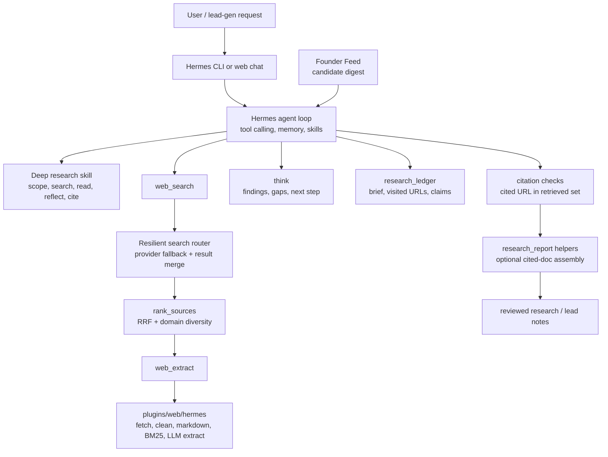

# Raeon Agent

[](https://github.com/thetanishqrathore/raeon-agent/actions/workflows/ci.yml)

Raeon Agent is a custom research and lead-generation build on top of the open-source [Nous Research Hermes Agent](https://github.com/NousResearch/hermes-agent). It keeps Hermes' core strengths, including the CLI, tool system, plugins, skills, memory, scheduled jobs, and web dashboard, then adds a research/search layer built for source-grounded business discovery workflows.

This repository is presented as a public portfolio snapshot of custom work. It is an independent customization of Hermes Agent, with upstream authorship and the MIT license retained in [LICENSE](LICENSE). The fork-specific provenance note is in [NOTICE.md](NOTICE.md).

Companion project: [Founder Feed Public](https://github.com/thetanishqrathore/founder-feed-public), a separate public repo that collects, scores, and emits a candidate digest that can feed Hermes cron or downstream agent workflows.

## What Is Custom Here

- Native web scraping and extraction under `plugins/web/hermes`, including deterministic HTML cleanup, markdown generation, chunking, BM25 ranking, and optional LLM extraction.
- A resilient search router that can merge or fail over across configured providers instead of silently returning empty results when one backend fails.
- Research tooling around source ranking, durable research ledgers, citation membership checks, and cited report assembly in `agent/research_*` and `tools/research_ledger_tool.py`.
- A `think` tool and research skill guidance that support explicit research reflection between search/extract rounds.
- Lead-generation helpers in `scripts/lead_gen_batch.py`, with tests for candidate filtering and source/citation plumbing.
- Web chat/dashboard polish and local auth setup for running the agent from a browser.

Hermes' upstream capabilities remain substantial: provider routing, model/tool orchestration, skills, memory, a CLI/TUI, messaging gateways, cron jobs, MCP support, desktop/web apps, and terminal/browser tools. This fork extends that base; it does not replace the upstream runtime.

## Architecture



## Local Setup

Use this checkout directly. Do not use the upstream Hermes installer or `hermes update` for this public snapshot, because those commands target the upstream project layout and may replace fork-specific files.

```bash
git clone https://github.com/thetanishqrathore/raeon-agent.git
cd raeon-agent

uv venv .venv --python 3.11
source .venv/bin/activate
uv pip install -e ".[dev,anthropic]"
uv pip install lxml==5.3.0 rank-bm25==0.2.2
```

If you do not use `uv`:

```bash
python3.11 -m venv .venv
source .venv/bin/activate
python -m pip install --upgrade pip
python -m pip install -e ".[dev,anthropic]"
python -m pip install lxml==5.3.0 rank-bm25==0.2.2
```

The web dashboard uses the root npm workspace:

```bash
npm ci --ignore-scripts
npm --workspace web run build
npm --workspace web test
```

This verifies the web dashboard build and tests. Desktop packaging has its own setup and is not part of this public web showcase.

## Offline Demo

The fastest credential-free showcase is a synthetic research run:

```bash
.venv/bin/python scripts/demo_research.py
```

It runs without network access, models, or persistent user state. The demo extracts from local synthetic HTML, ranks and deduplicates sources, checks citation provenance by flagging an unretrieved URL, and reopens a SQLite research ledger.

For a broader focused test pass:

```bash
scripts/run_tests.sh \
  tests/agent/test_research_ranking.py \
  tests/agent/test_research_citations.py \
  tests/agent/test_research_report.py \
  tests/agent/test_research_state.py \
  tests/tools/test_think_tool.py \
  tests/tools/test_research_ledger_tool.py \
  tests/scripts/test_lead_gen_batch.py \
  tests/plugins/web/test_hermes_scraper.py \
  tests/plugins/web/test_resilient_router.py \
  tests/hermes_cli/test_research_config.py \
  tests/hermes_cli/test_search_router_config.py \
  -q
```

The full agent can be launched locally after provider credentials are configured:

```bash
hermes
```

Optional browser dashboard auth can be generated with:

```bash
scripts/web-chat-setup-auth.sh
```

See [docs/web-chat-deploy.md](docs/web-chat-deploy.md) for local dashboard notes and [deploy/agent.env.example](deploy/agent.env.example) for credential names.

## Limits

Raeon Agent improves research discipline, but it is still an agentic software system. The code can check that cited URLs came from retrieved search/extract results; it does not prove every claim is true. Some conventions are enforced by prompt and skill instructions, such as when to reflect, when to delegate, and how much evidence to gather. Treat generated research and lead lists as drafts that need human review before client delivery, outreach, or business decisions.

This public snapshot has been cleaned for sharing, but no public repository should be treated as security-audited solely because secret scanning has been run. For a clean exported source tree, run:

```bash
gitleaks dir . --redact
```

Scanning a development checkout with dependencies can be noisy because vendored packages, fixtures, public IDs, and generated assets may trigger detections. Prefer scanning the clean source export that will actually be published.

The prepared release copy was scanned with Gitleaks and had no unreviewed findings after narrow fingerprint exceptions for reviewed fixtures, public IDs, and generated/doc assets. Those exceptions are release-hygiene evidence, not a security-audit guarantee.

The current web app production dependency audit is clean after compatible fixes. Remaining advisories are inherited development/Electron-toolchain findings; they are documented for maintainers rather than claimed away by a forced major upgrade.

## Source Map

| Area | Files |
|---|---|
| Native extraction | `plugins/web/hermes/`, `tools/web_tools.py` |
| Search routing | `plugins/web/resilient/`, `plugins/web/google_cse/`, `hermes_cli/config.py` |
| Research state and citation checks | `agent/research_citations.py`, `agent/research_ranking.py`, `agent/research_report.py`, `agent/research_state.py` |
| Research tools | `tools/think_tool.py`, `tools/rank_sources_tool.py`, `tools/research_ledger_tool.py` |
| Lead generation | `scripts/lead_gen_batch.py`, `tests/scripts/test_lead_gen_batch.py` |
| Web dashboard | `web/`, `scripts/web-chat-setup-auth.sh`, `scripts/web-chat-serve.sh` |
| Public release notes | `docs/public-release.md`, `docs/ci.md`, `docs/research/` |

## License

MIT. See [LICENSE](LICENSE) and [NOTICE.md](NOTICE.md).
