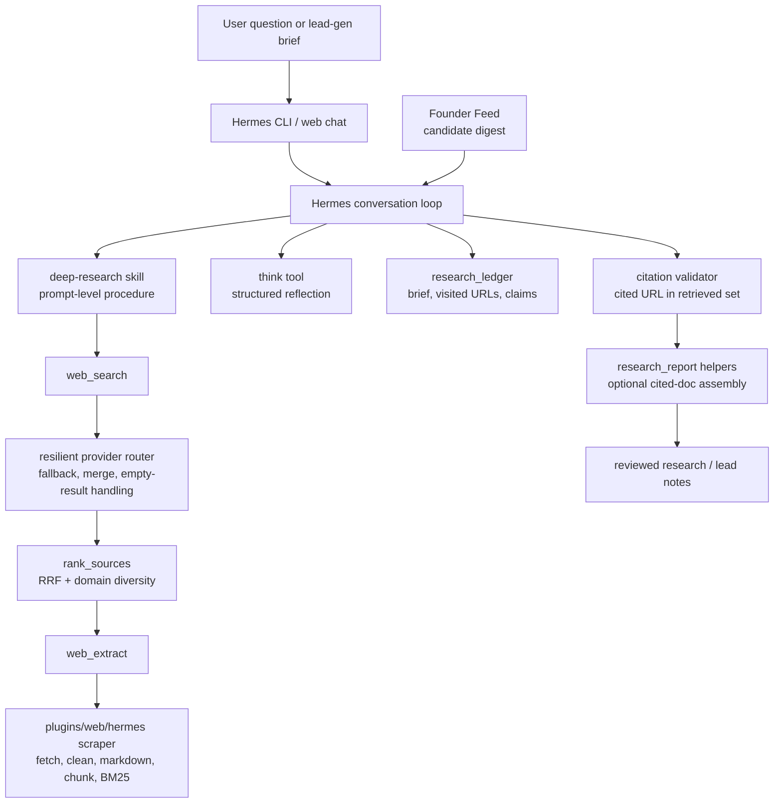

# Research Architecture

Raeon Agent keeps Hermes' existing single agent loop and adds a small set of research-specific tools and libraries around it. The diagram below is conceptual and skill-driven: the model still chooses tools through normal Hermes tool calling.

## Implemented Code

- `plugins/web/hermes`: native scraper and extraction pipeline.
- `plugins/web/resilient`: search-provider fallback and result merge logic.
- `agent/research_ranking.py`: source ranking and domain diversity helpers.
- `agent/research_citations.py`: citation extraction, URL canonicalization, retrieved-set checks, and citation nudge helpers.
- `agent/research_state.py`: SQLite-backed research ledger.
- `agent/research_report.py`: cited-source section and report-context helpers.
- `tools/think_tool.py`, `tools/rank_sources_tool.py`, `tools/research_ledger_tool.py`: model-callable research tools.
- `scripts/demo_research.py`: offline synthetic demo of extraction, ranking, citation provenance, and ledger reopen.

## Prompt Conventions

The deep-research skill instructs the model to scope the request, search, rank, extract, reflect, track sources, and cite retrieved evidence. Those conventions improve behavior but are not the same as a hard runtime proof. The hard checks in this snapshot cover selected mechanics, such as source ranking, ledger persistence, and whether cited URLs were retrieved. `research_report.py` is a helper library; it is not a guarantee that every final answer used the helper.
